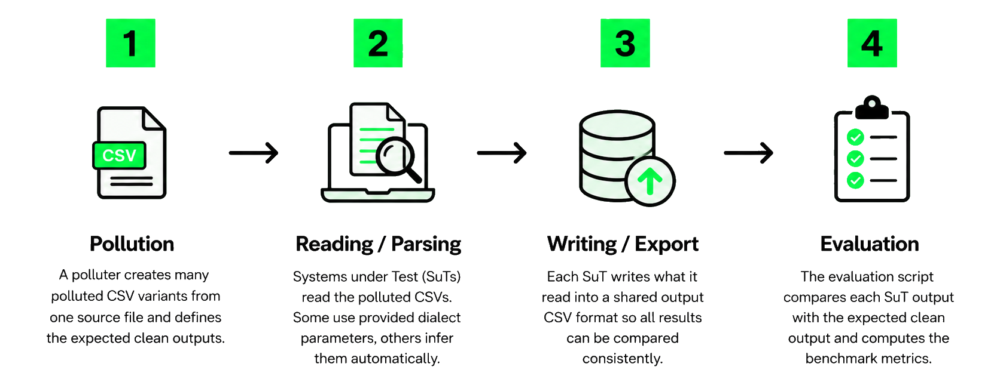

!This is not the original readme but an attempt at explaining what is going on from Robin (Student Research Assistant at UTN's Data Systems Lab)


# Running the Benchmark

## 1. Install Dependencies

Make venv, source it and install the packages from requirements.txt
```
python3 -m venv .venv
source .venv/bin/activate
pip install -r requirements.txt
```
## 2. Pollution (skip this if you want comparable scores and use the default benchmark source file)
<details>
<summary>
more...
</summary>


Put your csv file file into ```data/<dataset_name>/```

Generate polluted variants (number depends on n_rows + n_cols of your file)

```bash
python3 pollute_main.py --source data/<dataset_name>/<your_csv_file>.csv --output data/<dataset_name>
```
**Note:** The explanations in ```Detailed explanation of the Pollock Benchmark Structure```, the   ```dataset_name``` is already replaced by ```polluted_files``` as it is the default one used by the original authors. This one is set in the ```.env``` file as the ```$DATASET``` variable default -> scripts default back to ```polluted_files``` if no other dataset name is passed or the ```.env``` file is not changed

</details>

## 3. Run custom SuTs

To run the template for your custom implementation on the same files used by the benchmark:
```but 
python3 ./sut/custom/custom-bench.py
```
or more generally:
```
DATASET=<dataset_name> python3 ./sut/<sut_name>/<sut_script>.py
```
to run a specific python sut against a custom dataset.

**Note1:** If you rerun this, make sure to **delete the old results output** before.  ```rm -r results/custom/<dataset_name>```.

If you need more complex dependencies, add them to the Dockerfile and then use 

```
docker-compose up custom-client
```

### Run all python-only SUTs (no docker needed)

<details>
  <summary>more...</summary>

python suts: duckdbauto, duckdbparse, pandas, pycsv, clevercsv, custom

```bash
scripts/run_python_suts.sh <dataset_name>
```

or just
```
scripts/run_python_suts.sh
```
to run on the default (polluted_files) folder in ```./data``` 
</details>

 

### Run all SUTS (Docker needed)

<details>
  <summary>more...</summary>

```
bash benchmark.sh
```
This will take a looong time, especially on the first pass as the docker images are sometimes > 300MB

To speed it up, comment out the SuTs that run for a long time like rhypoparsr or libreoffice.

</details>


## 4. Evaluation

```
python3 evaluate.py --sut <sut> --dataset <dataset_name>
```
e.g. 
```
python3 evaluate.py --sut custom
```
to run the custom sut against the ```data/polluted_files``` folder

evalates all suts if no sut is passed (takes long). dataset defaults to ```polluted_files```

### Take a look at already computed scores

```
python3 scripts/results_tables.py --dataset <dataset>
```  
If you want to get a table of SuTs and their respective scores without having to rerun the evaluate script (which can take some time), run the python file .
**This only works after evaluate has been run once before.**


### Looking at which loaded files contain errors


```
python3 scripts/find_errors.py --sut <sut> 
```
This writes a .txt file containing information about what errors the given SUT made into ```results/<sut>/<dataset>/<sut>_errors.txt```


# Getting Started with your own Approach

A template for a custom SuT is provided in ```sut/custom```. Just change the function in ```solution.py``` any way you like or substitute it entirely inside ```custom-bench.py```.
A rudimentary Dockerfile has also been setup, so you can add more complex dependencies.

The score to beat with an automatic inference solution that does not use the provided dialect information is either Univocity (9.939419 simple,7.936767 weighted) or the Python default parser ( 9.724189 simple, 9.436467 weighted) depending on whether improvement in the simple or the unweighted category is the goal.

Have fun and happy hacking ;)


# Overview of SUTs and Scores 

| SUT         | pollock_simple | pollock_weighted | Uses dialect info? | Runtime |
| ----------- | -------------: | ---------------: | --------------------------- | ------- |
| custom      |    10.0 (soon) |      10.0 (soon) | No                        | Python or Docker  |
| duckdbparse |       9.961516 |         9.599662 | Yes                         | Python  |
| mariadb     |       9.953843 |         9.610157 | Yes                         | Docker  |
| mysql       |       9.953843 |         9.610157 | Yes                         | Docker  |
| univocity   |       9.939419 |         7.936767 | No          | Docker  |
| sqlite      |       9.936568 |         9.589233 | Yes                         | Docker  |
| spreaddesktop|	    9.929668 |         9.597198 | N/A         | N/A |
| libreoffice |       9.925582 |         7.833335 | Yes                         | Docker  |
| pandas      |       9.884786 |         7.909017 | Yes                         | Python  |
| pycsv       |       9.724189 |         9.436467 | No          | Python  |
|spreadweb    |	      9.721757 |         9.431587 | N/A         | N/A |  
| duckdbauto  |       9.646808 |         8.996221 | No                          | Python  |
| clevercs    |       9.193083 |         9.453858 | No          | Python  |
| dataviz     |       5.003541 |         5.152075 | N/A     | N/A |
| hypoparsr   |       3.877452 |         4.400585 | No | Docker |
| postgres    |       0.141977 |         7.872715 | Yes                         | Docker  |


The rows with N/A are SuTs where the license agreement prohibits public benchmarking which is why the benchmark authors only them using a pseudonym and without Docker reproducibility.


# Detailed explanation of the Pollock Benchmark Structure 

## 0. Benchmark Overview (read first)
1. The polluter writes polluted versions of the ```results/source.csv``` file into ```data/polluted_files/csv/```. It also writes the expected output of files that are read with the correct grammar (which is known by the polluter) into ```data/polluted_files/clean/```. These serve as the basis for comparison with what the SuTs have read from the polluted files later. On top of this, the polluter also writes the dialect information (e.g. delimiter, column datatypes, quote character etc.) into ```data/polluted_files/parameters/```
2. The different SuTs read the files from ```data/polluted_files/csv/```. 
3. The different SuTs write the content of their respective databases/dataframes etc. into ```results/<sut>/polluted_files/loading/``` 
4. The evaluation script ```evaluate.py``` uses Multi-Set operations to compare the outputs of the SuTs (```results/<sut>/polluted_files/loading/```) with the expected clean outputs in (```data/polluted_files/clean/```). It does so on a per-row (record) and per-cell basis. The final score is a mix of loading-success and recall + precision metrics (for formula, see the more detailed explanation of the Evaluation below)




## 1. Pollution - more details

The file ```results/source.csv``` with 83 data rows + a header is the ONLY file that is polluted. 
Every polluted file is derived from ```results/source.csv```.
The file properties were chosen to include various datatypes and a length that matches the median of the survey done on government CSV-files in the Pollock Paper.

The paper describes the pollution process further but basically it works like this:  
**Take the base-dialect of the ```results/source.csv``` file and change things about this dialect. Think: separator, quote character, escape character, header/no header/multi-header.**
Sometimes this is done on a per-line or even per-line + per-column level. The type of pollution is indicated in the filename of the csv file.
**Additionally, it does things like adding additional stray quote characters into fields or leave out a separator**. These pollutions can change what the semantic content of a file is, which is why the benchmark has to save a clean version of each polluted file in ```data/polluted_files/clean/```.


In a few cases, the mapping from a pollution to "What should be the actual expected clean outcome" can be ambiguous. e.g. What is the correct way of parsing a header with 3 rows?

```
col1, col2
col1, col2
col1, col2
```
According to the benchmark, the resulting header should look like this ```"col1 col1 col1", "col2 col2 col2"```. While this is not illogical, it is just a convention and thus up for debates. Who is to say that there should not be ```\n``` or any other delimiter other than spaces between the occurrences of "col1"?

Another example that basically every SuT gets wrong is that the benchmark tries to emulate CSVs with multiple files


## 2 + 3 SuT CSV parsing - more details

Every SuT tries to read the polluted files in ```data/polluted_files/csv/```. After it is read into the SuT, it is dumped to ```results/<sut>/polluted_files/loading/``` using a shared csv-dialect (the one by pandas .to_csv() function).

**Some of the systems (e.g. duckdbparse) are given the dialect** info from ```data/polluted_files/parameters/```, others (e.g. duckdbauto or clevercsv) infer them automatically. In general, the benchmark tried to be a "best effort" benchmark, meaning that the benchmark score directly correlates with the number of settings a given SuT has to deal with different dialects. In general comparisons between SuTs only make sense if they are either both using the supplied metadata (e.g. duckdbparse, sqlite) or not using it at all (e.g. duckdbauto, clevercsv).

This is heavily dockerized (one docker for every SuT) in the default Pollock  [GitHub repo](https://github.com/HPI-Information-Systems/Pollock). Which does not mean the default repo is reproducible since it suffers from a pandas<->numpy dependency conflict due to non-pinned versions which is fixed here.

## 4 Evaluation - more details

The final Benchmark score is calculated as follows:

```
Score = mean(success)
  + mean(header_precision) + mean(header_recall) + mean(header_f1)
  + mean(record_precision) + mean(record_recall) + mean(record_f1)
  + mean(cell_precision)   + mean(cell_recall)   + mean(cell_f1)
```
Each component is from [0,1], so the maximum score is 10.

The evaluation script writes the scores per file into ```results/<sut>/polluted_files```.

Since not every pollution is equally likely to be found "in the wild", the Pollock score also comes in a weighted variant, which bases its weightings on a survey of governmental csv files done for the Pollock paper. Note: This weighted score is only accurate when using the original ```results/source.csv``` since the number times a pollution is used depends on the row + column counts of the polluted file and the weights are were hardcoded by the authors in ```pollock_weights.json```


# Boring Section:
## Things to note / limitations

1. Some sut versions had to be changed compared to the original Pollock Benchmark (e.g. Pandas is now 3.x and not 1.x anymore). This might lead to different scores
2. DuckDB-Auto had a bug where it correctly read datetime but wrote it in a different format than expected by the benchmark, which is why its score in the original repo is lower.
3. Most non-python SuTs require Docker. Their original and mostly broken dependencies were updated and they should run now. However, the score might have moved slightly due to changes in how csvs are parsed between the old and new versions of the suts as some legacy docker containers were not distributed anymore.

