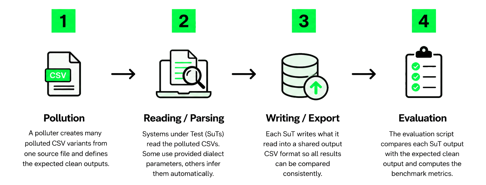

# Pollock Offsite

This repository generates polluted CSV datasets, runs CSV parsing systems under
test (SUTs), and evaluates their reconstructed output against known clean data.

## Quick Start: CSV Storm with Ollama

### 1. Set Up Python and Ollama

```bash
python3 -m venv .venv
source .venv/bin/activate
pip install -r requirements.txt
```

If Ollama is not already running, start it in a separate terminal and leave it
running while the benchmarks execute:

```bash
ollama serve
```

Back in the repository terminal, download the model:

```bash
ollama pull qwen3.5:0.8b
```

### 2. Download CSV Storm

CSV Storm will be published on the Hugging Face Dataset Hub:

>  **Dataset download:** [CSV Storm on Hugging Face — link to be added](https://huggingface.co/datasets/REPLACE_WITH_ORGANIZATION/REPLACE_WITH_DATASET)

Or generate the dataset locally:

```bash
.venv/bin/python pollute_main.py \
  --source ./results/source.csv \
  --output ./data/csv_storm \
  --polluters pollock2.0 \
  --combinations \
  --overwrite
```

Whether downloaded or generated, the CSV files must be located in
`data/csv_storm/csv/`.

### 3. Run Both LLM Architectures

Full LLM parser:

```bash
DATASET=csv_storm .venv/bin/python sut/full_llm_loader/custom-bench.py \
  --backend ollama \
  --model qwen3.5:0.8b \
  --version naive \
  --overwrite
```

Hybrid parser:

```bash
DATASET=csv_storm .venv/bin/python sut/llm_hybrid_parser_Robin/llm-hybrid-bench.py \
  --backend ollama \
  --model qwen3.5:0.8b \
  --overwrite
```

For a quick smoke test, append
`--file file_field_delimiter_0x3B.csv` to either command.

### 4. Evaluate the Results

```bash
.venv/bin/python evaluate.py \
  --sut full_llm_loader_naive_qwen3_5_0_8b \
  --dataset csv_storm

.venv/bin/python evaluate.py \
  --sut llm_hybrid_parser_qwen3_5_0_8b \
  --dataset csv_storm
```

Parser output is written under `results/<sut>/csv_storm/loading/`.

### 5. CSV Storm Evaluation Results

<!-- CSV_STORM_RESULTS_START -->
| Parser | Model | Exact file matches | Accuracy |
| --- | --- | ---: | ---: |
| Full LLM (naive) | `qwen3.5:0.8b` | 0/68 | 0.0% |
| Hybrid | `qwen3.5:0.8b` | 21/68 | 30.9% |
<!-- CSV_STORM_RESULTS_END -->

These are strict whole-file accuracy results: a file counts as correct only
when its evaluated output matches an accepted CSV Storm ground truth.

Refresh this table from the latest evaluation CSVs after rerunning the parsers:

```bash
.venv/bin/python scripts/update_readme_csv_storm_results.py
```

To verify in CI that the embedded table is current, run:

```bash
.venv/bin/python scripts/update_readme_csv_storm_results.py --check
```

## Running the Benchmark


### 1. Install Dependencies

Create and activate a virtual environment, then install the dependencies:

```bash
python3 -m venv .venv
source .venv/bin/activate
pip install -r requirements.txt
```
### 2. Pollution

Skip this step if you want scores comparable with the default benchmark dataset.
<details>
<summary>Generate a custom polluted dataset</summary>


Place your source CSV file in `data/<dataset_name>/`.

Generate polluted variants. The number produced depends on the source file's
row and column counts:

```bash
.venv/bin/python pollute_main.py \
  --source data/<dataset_name>/<your_csv_file>.csv \
  --output data/<dataset_name>
```

Generate CSV Storm using Pollock 2.0 and curated pollution combinations. The
filenames contain the ordered pollution names and their structural parameters:

```bash
.venv/bin/python pollute_main.py \
  --source ./results/source.csv \
  --output ./data/csv_storm \
  --polluters pollock2.0 \
  --combinations \
  --overwrite
```

The detailed benchmark explanation below uses `polluted_files` as the dataset
name because that is the original benchmark default. Set `DATASET` explicitly
or configure it in `.env`; scripts fall back to `polluted_files` when neither is
provided.

</details>

### 3. Run Custom SUTs

Run the custom implementation template on the default benchmark dataset:

```bash
.venv/bin/python ./sut/custom/custom-bench.py
```

More generally, run a Python SUT against a specific dataset with:

```bash
DATASET=<dataset_name> .venv/bin/python ./sut/<sut_name>/<sut_script>.py
```

Use the SUT's `--overwrite` option when available to regenerate existing
results.

If your SUT needs more complex dependencies, add them to its Dockerfile and run:

```bash
docker-compose up custom-client
```

#### Run All Python-Only SUTs

<details>
  <summary>Show commands</summary>

The Python-only SUTs are `duckdbauto`, `duckdbparse`, `pandas`, `pycsv`,
`clevercsv`, and `custom`.

```bash
scripts/run_python_suts.sh <dataset_name>
```

Run the default `polluted_files` dataset with:

```bash
scripts/run_python_suts.sh
```
</details>

#### Run the LLM parsers locally with Ollama

Both LLM parser architectures use Ollama's OpenAI-compatible API. Start
`ollama serve` in a separate terminal if Ollama is not already running. Then
make sure the exact model name shown by `ollama list` is available:

```bash
ollama pull qwen3.5:0.8b
```

No `OPENAI_API_KEY` is needed. Run the complete CSV Storm dataset with the
full-LLM parser:

```bash
DATASET=csv_storm .venv/bin/python sut/full_llm_loader/custom-bench.py \
  --backend ollama \
  --model qwen3.5:0.8b \
  --version naive \
  --overwrite
```

Run CSV Storm with the hybrid parser (LLM dialect detection and malformed-row
repair are enabled by default):

```bash
DATASET=csv_storm .venv/bin/python sut/llm_hybrid_parser_Robin/llm-hybrid-bench.py \
  --backend ollama \
  --model qwen3.5:0.8b \
  --overwrite
```

CSV Storm input is read from `data/csv_storm/csv/`. To test only one file,
append `--file file_field_delimiter_0x3B.csv`. Add `--verbose` to either command
to print prompts and responses. If Ollama is not listening on its default URL,
add `--api-base http://<host>:<port>/v1`.

The equivalent shared environment configuration is:

```bash
export LLM_BACKEND=ollama
export OLLAMA_MODEL=qwen3.5:0.8b
export OLLAMA_API_BASE=http://localhost:11434/v1
```

`OLLAMA_REASONING_EFFORT` defaults to `none`, which makes structured CSV/JSON
responses more predictable. Override it if the selected model benefits from
thinking mode. See the
[Ollama OpenAI compatibility documentation](https://docs.ollama.com/api/openai-compatibility)
for supported request fields.

#### Run All SUTs with Docker

<details>
  <summary>Show commands</summary>

```bash
bash benchmark.sh
```
This can take a long time, especially on the first run, because some Docker images exceed 300 MB.

To reduce runtime, disable SUTs that you do not need in `benchmark.sh`.

</details>


### 4. Evaluation

```bash
.venv/bin/python evaluate.py --sut <sut> --dataset <dataset_name>
```
For example, evaluate the custom SUT against `data/polluted_files` with:

```bash
.venv/bin/python evaluate.py --sut custom --dataset polluted_files
```

If `--sut` is omitted, the script evaluates every SUT, which can take a long time. The dataset defaults to `polluted_files`.

#### Inspect Errors in Loaded Files


```bash
.venv/bin/python eval/find_errors.py --sut <sut>
```
This writes a text report describing the selected SUT's errors to
`results/<sut>/<dataset>/<sut>_errors.txt`.


## Getting Started with Your Own Approach

A template for a custom SUT is provided in `sut/custom`. Modify the function in
`solution.py`, or replace its invocation in `custom-bench.py` with your own implementation.
A basic Dockerfile is also provided, so you can add more complex dependencies.

The score to beat with an automatic inference solution that does not use the provided dialect information is either Univocity (9.939419 simple, 7.936767 weighted) or the Python default parser (9.724189 simple, 9.436467 weighted) depending on whether improvement in the simple or the unweighted category is the goal.


## Overview of SUTs and Scores

| SUT         | pollock_simple | pollock_weighted | Uses dialect info? | Runtime |
| ----------- | -------------: | ---------------: | --------------------------- | ------- |
| custom      |    10.0 (soon) |      10.0 (soon) | No                        | Python or Docker  |
| duckdbparse |       9.961516 |         9.599662 | Yes                         | Python  |
| mysql       |       9.953843 |         9.610157 | Yes                         | Docker  |
| univocity   |       9.939419 |         7.936767 | No          | Docker  |
| sqlite      |       9.936568 |         9.589233 | Yes                         | Docker  |
| pandas      |       9.884786 |         7.909017 | Yes                         | Python  |
| pycsv       |       9.724189 |         9.436467 | No          | Python  |
| duckdbauto  |       9.646808 |         8.996221 | No                          | Python  |
| clevercsv   |       9.193083 |         9.453858 | No          | Python  |
| postgres    |       0.141977 |         7.872715 | Yes                         | Docker  |


## Detailed Explanation of the Pollock Benchmark Structure

### 0. Benchmark Overview
1. The polluter writes corrupted versions of `results/source.csv` to
   `data/polluted_files/csv/`. It writes the corresponding expected output to
   `data/polluted_files/clean/` and dialect metadata to
   `data/polluted_files/parameters/`.
2. Each SUT reads files from `data/polluted_files/csv/`.
3. Each SUT writes normalized CSV output to
   `results/<sut>/polluted_files/loading/`.
4. `evaluate.py` compares each SUT output with the expected clean output using
   multiset operations at the record and cell levels. The final score combines
   loading success, precision, recall, and F1 metrics.

#### Ground-Truth Bundles

`clean/<filename>` remains the backward-compatible canonical single-table output.
Generation also writes `ground_truth/<filename>/manifest.json`. Ordinary
pollutions contain one canonical alternative. Ambiguous pollutions may register
multiple alternatives that reference reusable table CSVs in the same directory.

For stacked multitable files, the manifest describes `primary_only`,
`secondary_only`, and canonical `all_tables` interpretations. Single-CSV SUT
outputs are evaluated against every `single_table` alternative, and evaluation
records the matching alternative ID. Ordered and unordered multi-table
alternatives are represented structurally for SUTs that support table bundles.




### 1. Pollution Details

The original benchmark pollutes `results/source.csv`, which contains a header
and 83 data rows.
For custom runs, pass any local CSV with `--source` and a dataset directory with `--output`.
The source contains several data types, and its length approximates the median
observed in the government CSV survey reported by the Pollock paper.

The polluter modifies properties of the source CSV dialect, including the field
separator, quote character, escape character, and header structure. Some changes
apply to an entire file; others affect an individual row or cell. Filenames encode
the applied pollution. Row-level corruptions can also add stray quotes or remove
separators. Because these changes may alter a file's apparent meaning, the
benchmark stores the intended clean interpretation in `data/polluted_files/clean/`.


Some pollutions allow more than one reasonable clean interpretation. For example,
consider a three-row header:

```csv
col1, col2
col1, col2
col1, col2
```
The benchmark joins repeated header values with spaces, producing
`"col1 col1 col1", "col2 col2 col2"`. This is a convention rather than the only
valid interpretation; a newline or another separator could also be reasonable.
Stacked tables introduce similar ambiguity, so ground-truth bundles can record
multiple acceptable interpretations.


### 2–3. SUT CSV Parsing Details

Each SUT reads polluted files from `data/polluted_files/csv/` and writes
normalized output to `results/<sut>/polluted_files/loading/` using the CSV
dialect produced by `pandas.DataFrame.to_csv()`.

Some SUTs, including `duckdbparse`, receive dialect metadata from
`data/polluted_files/parameters/`; others, including `duckdbauto` and
`clevercsv`, infer the dialect automatically. Comparisons are most meaningful
between SUTs with the same metadata access.

The original Pollock [GitHub repository](https://github.com/HPI-Information-Systems/Pollock)
uses a separate Docker container for each SUT. This fork updates dependencies to
resolve the original unpinned pandas and NumPy version conflict.

### 4. Evaluation Details

The final benchmark score is calculated as follows:

```
Score = mean(success)
  + mean(header_precision) + mean(header_recall) + mean(header_f1)
  + mean(record_precision) + mean(record_recall) + mean(record_f1)
  + mean(cell_precision)   + mean(cell_recall)   + mean(cell_f1)
```
Each component ranges from 0 to 1, so the maximum score is 10.

The evaluation script writes per-file scores to `results/<sut>/polluted_files/`.

Because pollutions do not occur equally often in real-world data, Pollock also
reports a weighted score based on a survey of government CSV files. This score is
only valid for the original `results/source.csv`: pollution frequencies depend
on its row and column counts, while the weights in `pollock_weights.json` are
fixed.


## Limitations and Compatibility Notes

1. Some SUT dependencies differ from the original Pollock benchmark; for example,
   this repository uses pandas 3.x instead of 1.x. Scores may therefore differ.
2. The original DuckDB-Auto implementation serialized datetime values in a format
   that differed from the benchmark expectation, reducing its original score.
3. Most non-Python SUTs require Docker. Their dependencies have been updated
   because some legacy images are no longer distributed. Parser behavior and scores
   may differ slightly from the original versions.